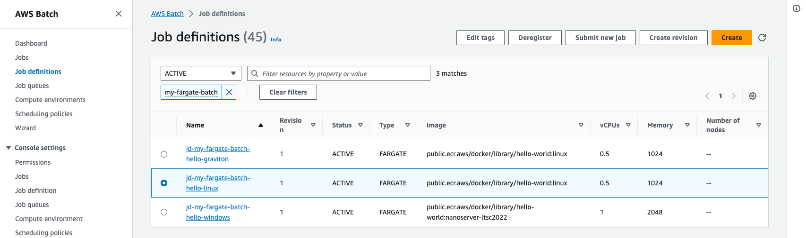
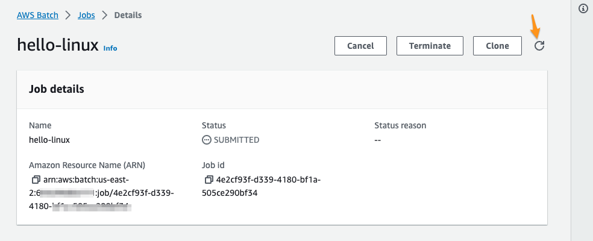
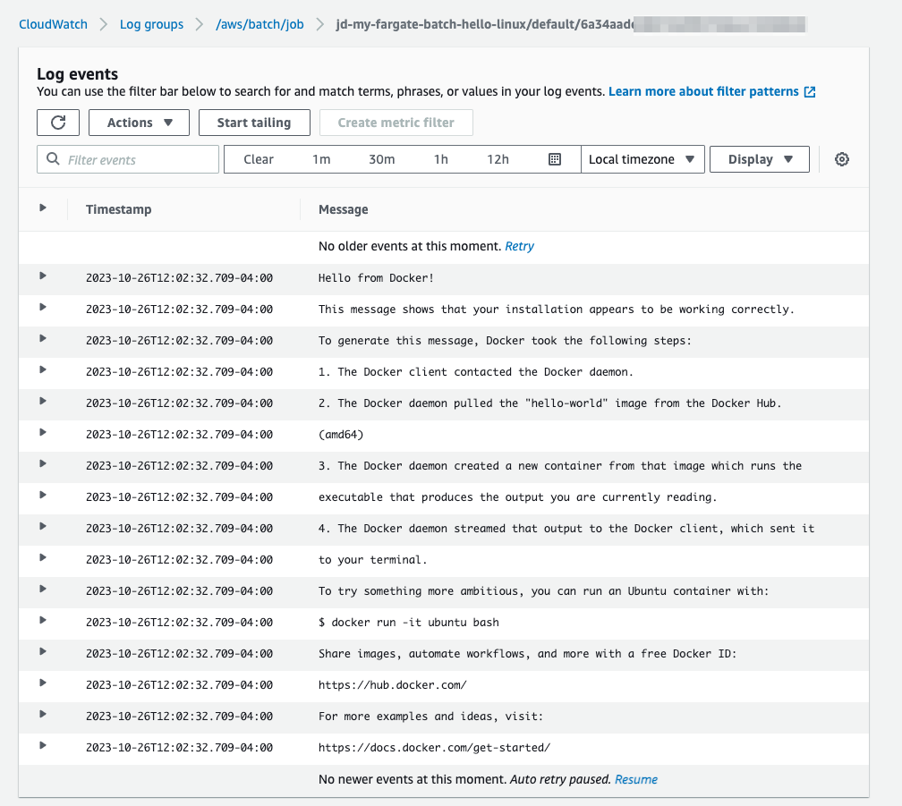

# How to use AWS Fargate with AWS Batch

This example shows how to you can leverage AWS Fargate resources with AWS Batch to run your batch or asynchronous workloads. 

You will: 

1. Create an AWS Batch compute environment that leverages Fargate resources
2. Create an AWS Batch job queue attached to the Fargate compute environment
3. Create AWS Batch job definitions for utilizing Fargate with Linux on x86_64 or ARM64 architectures, or [supported Windows versions](https://docs.aws.amazon.com/AmazonECS/latest/developerguide/platform-windows-fargate.html) on x86_64
4. Run the created job definitions and view the results

> [!IMPORTANT]
> Fargate support for Linux and Windows containers is AWS Region and Availability Zone dependent. To check if your Region and Availability Zone is support, consult the [Supported Regions for Amazon ECS on AWS Fargate](https://docs.aws.amazon.com/AmazonECS/latest/developerguide/AWS_Fargate-Regions.html) documentation page.
  

## Cost 

AWS Batch is free to use, you only pay for the Fargate and storage resources that are allocated when running a job. In this case, each example job takes less than two minutes to complete and all tests should be under $5 USD to run. 

> [!IMPORTANT]
> While the created AWS Batch resources are no cost, the VPC NAT Gateway does incur charges. 
> Be sure to read the [Cleanup](#cleanup) instructions for deleting resources that may result in AWS charges beyond running the examples.

## Prerequisites

Fargate resources are deployed into VPC subnets in your own account. We have provided two templates that will either (a) utilize your own VPC, or (b) create a VPC and subnet for you to run Batch jobs.

In either case, you must have administrative permissions to create an IAM role for the jobs.

## Deploy an AWS Batch Fargate environment

### Deploy using an existing VPC

The following AWS CloudFormation template creates AWS Batch resources in an existing VPC in your account with a public and private subnet, and the associated VPC internet and NAT gateways.

> [!NOTE]
> It is **highly recommended** that you review your VPC subnets and security groups and have those IDs ready for this next step. 

**To deploy the AWS Batch Fargate environment in am existing VPC:**

1. Log into the AWS CloudFormation Management console at https://console.aws.amazon.com/cloudformation/home?#
2. Choose **Create stack / With new resources (standard)**
3. In the **Specify template** box, choose **Upload a template file**, then use your file browser to upload the [batch-fargate-existing-vpc.yaml](../../fargate/cloudformation/batch-fargate-existing-vpc.yaml) CloudFormation template. 
4. Choose **Next**.
5. In the **Stack name** box, enter a name for your stack (for example "my-fargate-batch")
6. In the **Parameters** section, in the **VPC Details** subsection, select one or more subnets from the list, taking care to choose subnets in the same VPC.
7. For **SecurityGroupId**, choose a security group with unbounded egress in the same VPC as the subnets chosen. 
8. In the **AWS Batch details** subsection, optionally change the value for the maximum number of concurrent vCPU that Fargate can launch. 
9. For **AutoAssignIp**, only choose `ENABLED` if the subnets chosen are public subnets. 
10. Choose **Next**
11. On the **Configure stack options** page, scroll to the bottom and choose **Next**
12. On the **Review** page, scroll to the bottom. In the **Capabilities** section, select the box that acknowledges that AWS CloudFormation might create IAM resources.
13. Choose **Submit**

The window will periodically refresh to show the progress of the CloudFormation stack creation. Once the status shows `CREATE_COMPLETE` for the stack you can proceed to the next section [Running the AWS Batch jobs](#running-the-aws-batch-jobs).

### Deploy using a new VPC

The following AWS CloudFormation template creates a new VPC in your account with a public and private subnet, and the associated VPC internet and NAT gateways.

**To deploy the AWS Batch Fargate environment in a new VPC:**

1. Log into the AWS CloudFormation Management console at https://console.aws.amazon.com/cloudformation/home?#
2. Choose **Create stack / With new resources (standard)**
3. In the **Specify template** box, choose **Upload a template file**, then use your file browser to upload the [batch-fargate-new-vpc.yaml](../../fargate/cloudformation/batch-fargate-new-vpc.yaml) CloudFormation template. 
4. Choose **Next**.
5. In the **Stack name** box, enter a name for your stack (for example "my-fargate-batch")
6. (Optional) Adjust the CIDR ranges for the VPC or the maximum number of vCPU that the compute environment can launch.
7. Choose **Next**
8. On the **Configure stack options** page, scroll to the bottom and choose **Next**
9. On the **Review** page, scroll to the bottom. In the **Capabilities** section, select the box that acknowledges that AWS CloudFormation might create IAM resources.
10. Choose **Submit**

The window will periodically refresh to show the progress of the CloudFormation stack creation. Once the status shows `CREATE_COMPLETE` for the stack you can proceed to the next section [Running the AWS Batch jobs](#running-the-aws-batch-jobs).

## Running the AWS Batch jobs

The above CloudFormation stack created everything you need to run an AWS Batch job on Fargate resources. 

**To run an AWS Batch job on Fargate resources:**

1. Log into the AWS Batch management console at https://console.aws.amazon.com/batch/home?#
2. Choose **Job definitions** from the left side navigation menu. 
3. In the *Filter resources by property value* text box, enter your stack name. You should see three job definitions with the name format of `jd-${STACK_NAME}-hello-${FARGATE_PLATFORM}`
   
4. To run the Linux X86_64 example, choose the one that ends with `linux`, then choose **Submit new job** at the top right corner.
5. Enter a name for the job (example: "hello-linux")
6. For the **Job queue** choose the created Batch job queue - it's the one with the stack name, in this example `jq-my-fargate-batch` - then choose **Next** 
7. On the **Overrides** page, scroll to the bottom and choose **Next**
8. On the **Job review** page, choose **Create job**

You have submitted the job and are now taken to the job's status page. 

You can refresh the status by clicking on the refresh symbol. Once the **Status** is `SUCCEEDED` you can follow the link to the log stream to see the output of the job. 

This will open a new browser window to the CloudWatch log stream, an example is shown below. 

### Running the other jobs 

You can follow the same proceedures as above to run the other jobs for Windows or Graviton by selecting the appropriate job definition and choosing **Submit new job**.

## Cleanup 

**To delete all resources created during this example:**

1. Log into the AWS CloudFormation management console at  https://console.aws.amazon.com/cloudformation/home?#
2. Locate and choose the stack name you created for this exercise. 
3. Select the **Delete** button, and then confirm that you want to delete all created resources by choosing **Delete** again.

All resources will have been deleted once the status of the stack shows `DELETE_COMPLETE`

